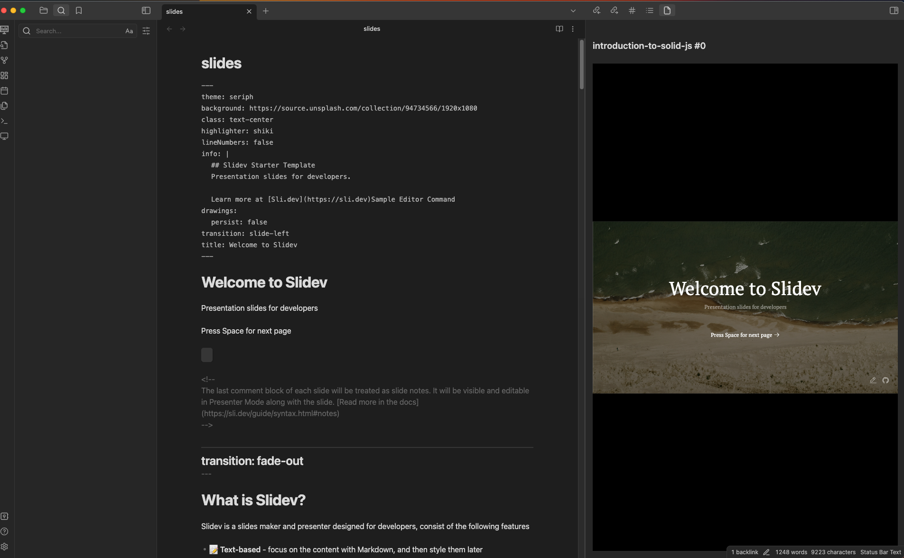

# Obsidian Slidev Plugin

This is [obsidian](https://obsidian.md) plugin that integrates [slidev](https://github.com/slidevjs/slidev) presentations.

[](./docs/screencast.mp4)

## Development

`git clone https://github.com/nirtamir2/obsidian-slidev.git`
Change `.env` file content to

```dotenv
OUT_DIR="<relative-path-to-your-vault>/.obsidian/plugins/obsidian-slidev"
```

run `pnpm i` and `pnpm dev`. Then you can enable the plugin in your vault (also you can change the debug setting to true).
You can also change the settings plugin `initialScript` to wherever you want that will load node.js in your PATH. For me it's `source ~/.profile`.
Also make sure you have existing folders for `dist` in this repo, and for your `OUT_DIR` in your vault (you may need to create `<relative-path-to-your-vault>/.obsidian/plugins/obsidian-slidev` folder.

[See more common issues here](./docs/common-problems.md)

## Credits

-   [Advances slides](https://github.com/MSzturc/obsidian-advanced-slides)
-   Slidev
    -   [slidev](https://github.com/slidevjs/slidev)
    -   [slidev-vscode](https://github.com/slidevjs/slidev-vscode)
-   Vite Starters
    -   with solid [obsidian-enhancing-export](https://github.com/mokeyish/obsidian-enhancing-export)
    -   with svelte [obsidian-svelte-plugin](https://github.com/emilio-toledo/obsidian-svelte-plugin)
-   [obsidian-execute-code](https://github.com/twibiral/obsidian-execute-code) - allows executing code in bash.
