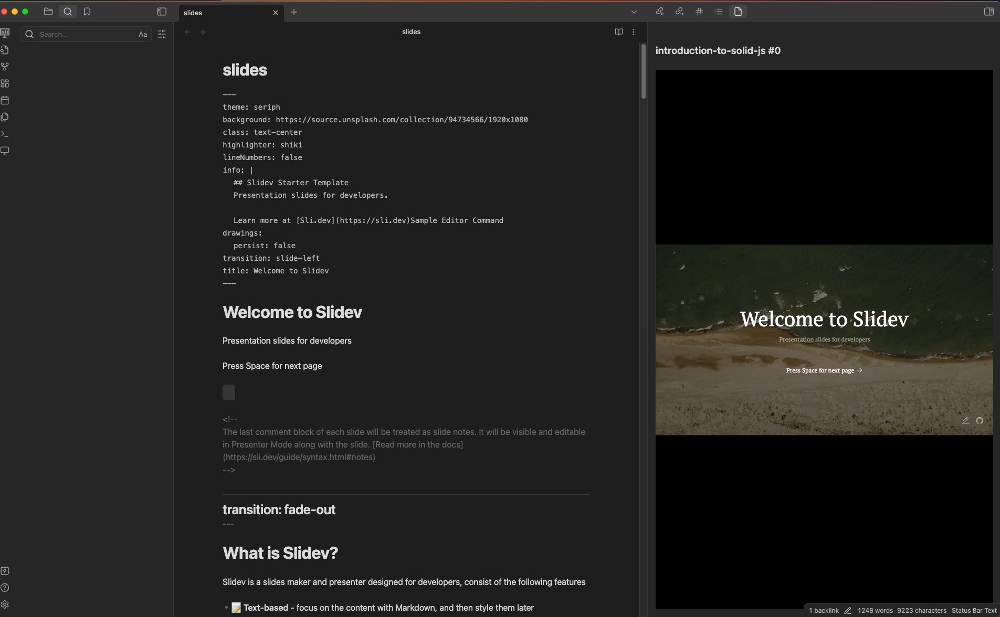

# Slidev for Obsidian

Preview Markdown presentations from your Obsidian vault with
[Slidev](https://sli.dev/). The plugin opens the active note in an embedded
presentation view and keeps the displayed slide aligned with your cursor.

[](https://community.obsidian.md/plugins/slidev)

[](./docs/screencast.mp4)

## Requirements

- The desktop version of Obsidian. The plugin starts a local Node.js process and does not support mobile Obsidian.
- [Node.js](https://nodejs.org/en/download) compatible with the version of
  Slidev used by your project. The plugin does not install or update Node.js.
- For **Set up Slidev**, npm installed alongside Node.js, network access to the
  npm registry, and write access to the vault root.
- For an existing project, `@slidev/cli` installed locally in that project's
  `node_modules` directory. A global `slidev` command is neither required nor
  used.
- Write access to the Slidev project while a presentation starts. The plugin creates a hidden temporary entry and bridge configuration there so Slidev can use that project's themes, addons, and components with notes stored elsewhere.

Quick setup installs a small, version-pinned Slidev starter only after you
select **Set up Slidev**. It never changes a project you configured manually.

## Install the plugin

### Community plugins

1. Open **Settings → Community plugins** in Obsidian.
2. Select **Browse**, search for **Slidev**, and select **Install**.
3. Enable **Slidev**.

### BRAT (beta releases)

1. Install and enable [BRAT](https://github.com/TfTHacker/obsidian42-brat) from the Obsidian Community Plugins directory.
2. In BRAT settings, select **Add beta plugin**.
3. Enter `https://github.com/nirtamir2/obsidian-slidev` and add the plugin.
4. In **Settings → Community plugins**, enable **Slidev**.

### Manual installation

1. Open the [latest GitHub release](https://github.com/nirtamir2/obsidian-slidev/releases/latest).
2. Download `main.js`, `manifest.json`, and `styles.css`.
3. Create `<your-vault>/.obsidian/plugins/slidev/` and place the three files in that directory.
4. Restart Obsidian, then enable **Slidev** under **Settings → Community plugins**.

## Set up Slidev

The quickest path is built into the presentation view:

1. Open a Markdown note.
2. Run **Slidev: Open presentation view** from the command palette, or select
   the presentation icon in the ribbon.
3. Select **Set up Slidev**.
4. Keep Obsidian open while the plugin creates `<your-vault>/.slidev/`,
   downloads its dependencies with npm, verifies the result, and saves it as
   the active Slidev project.

You can run the same setup from **Settings → Slidev → Quick setup**. If an
installation is interrupted, select **Retry setup**; the plugin reuses its
generated project and asks npm to finish installing it.

### Use an existing Slidev project

To use custom themes, addons, components, or a project stored outside the
vault, create and install a Slidev project by following the
[official getting-started guide](https://sli.dev/guide/). For example:

```sh
pnpm create slidev
cd <your-slidev-project>
pnpm install
```

Then open **Settings → Slidev**:

1. Set **Slidev project folder** to the project directory containing
   `node_modules/@slidev/cli/package.json`.
2. Leave **Node.js executable** empty to use `node` from Obsidian's inherited
   `PATH`. If Obsidian cannot find a shell-managed Node.js installation, enter
   the absolute path to the executable.
3. Keep the default **Port** (`3030`) or choose a free port from 1 through 65535.
4. Select **Verify** beside the project folder and resolve any reported issue.

Entering a project folder disables quick setup; the plugin does not modify or
install dependencies in that project.

The other settings are optional:

- **Show slide numbers in reading view** labels Slidev separators with the
  number of the following slide.
- **Debug mode** adds server controls and process output to the presentation
  view.

## Present a note

1. Open an existing Markdown note stored in a local vault.
2. Run **Slidev: Open presentation view** from the command palette, or select
   the presentation icon in the ribbon.
3. Complete **Set up Slidev** if prompted. Once configured, the view starts or
   connects to Slidev automatically.

The plugin connects to an existing server on the configured port when one is
available. Otherwise, it launches the configured project's local Slidev CLI
for the active note. Closing the view stops only the process started by that
view. Changing the active note restarts that owned process for the new note.

Use standard Slidev Markdown in the note, including `---` slide separators.
The buttons above the embedded deck open the current slide in a browser or open
Slidev's presenter view.

If startup fails, see [Common problems](./docs/common-problems.md).

## Disclosures

Slidev preserves Obsidian's offline-first model, with the following local access required for its core functionality:

- **Network use:** After you explicitly select **Set up Slidev**, the plugin runs npm to download the pinned starter dependencies from npm's configured registry. During presentations, it requests and embeds the local Slidev server at `http://localhost:<port>/`. That local Vite server may serve requested assets under the vault root so note-relative media works. The generated bridge blocks direct access to `.obsidian`, unrelated Markdown/Canvas files, and common configuration-data formats. The plugin includes no telemetry. npm, a presentation, a theme, or a Slidev dependency may make its own network requests.
- **Files and ownership:** Quick setup creates `<your-vault>/.slidev/` with a marked `package.json`, npm's lockfile, and `node_modules`. It refuses to use a symlink or an existing unmarked `.slidev` directory and never deletes the generated project automatically. A manually configured Slidev project may be outside the vault. The plugin reads that project's `@slidev/cli` package metadata and executable files, but does not install or change its dependencies. At launch it creates a temporary `.obsidian-slidev-<id>.md` entry and matching `.obsidian-slidev-<id>/` bridge directory in the configured project. Both are removed when the owned process exits or the view restarts/closes. Matching leftovers after an abrupt shutdown may retain vault paths and deck headmatter but are safe to delete after stopping Slidev.
- **External processes:** Quick setup starts the configured Node.js executable with npm's CLI and fixed install arguments, without a shell. npm dependency install scripts may execute as part of the installation. When a presentation needs a server, the plugin starts the same Node.js executable with the project-local Slidev CLI and the temporary entry as separate arguments, also without a shell. The plugin stops only presentation processes it started; it does not stop a server that was already running.
- **Trusted content:** Slidev presentations and npm dependencies can compile or execute JavaScript and read files available to them. Only set up maintained dependencies and launch notes, themes, addons, and project code you trust.

## Contributing

See [CONTRIBUTING.md](./CONTRIBUTING.md) for the full development and pull
request guide. The quick setup is:

```sh
git clone https://github.com/nirtamir2/obsidian-slidev.git
cd obsidian-slidev
pnpm install
pnpm test
pnpm run type-check
pnpm run build
```

Useful commands:

| Command                 | Purpose                                            |
| ----------------------- | -------------------------------------------------- |
| `pnpm dev`              | Watch source files and rebuild in development mode |
| `pnpm test`             | Run the Vitest test suite once                     |
| `pnpm run lint`         | Check supported repository files with ESLint       |
| `pnpm run format:check` | Check formatting with Prettier                     |
| `pnpm run type-check`   | Check TypeScript without emitting files            |
| `pnpm run build`        | Create a production build                          |
| `pnpm run verify:build` | Verify the generated plugin artifacts              |
| `pnpm run ci`           | Run the complete local CI pipeline                 |

Production builds are written to `dist/`. To build directly into a development
vault, set `OUT_DIR` to the vault's `.obsidian/plugins/slidev` directory in
`.env.development.local`, then run `pnpm dev`:

```dotenv
OUT_DIR=/absolute/path/to/vault/.obsidian/plugins/slidev
```

Do not commit that machine-specific environment file. See
[Common problems](./docs/common-problems.md#development-build-output) if the
output is not where you expect.

## Credits

- [Advanced Slides](https://github.com/MSzturc/obsidian-advanced-slides)
- [Slidev](https://github.com/slidevjs/slidev) and [Slidev for VS Code](https://github.com/slidevjs/slidev-vscode)
- [Solid](https://github.com/solidjs/solid)
- Vite starters: [Obsidian Enhancing Export](https://github.com/mokeyish/obsidian-enhancing-export) and [Obsidian Svelte Plugin](https://github.com/emilio-toledo/obsidian-svelte-plugin)
- [Execute Code](https://github.com/twibiral/obsidian-execute-code)
- [Obsidian Pandoc](https://github.com/OliverBalfour/obsidian-pandoc)
